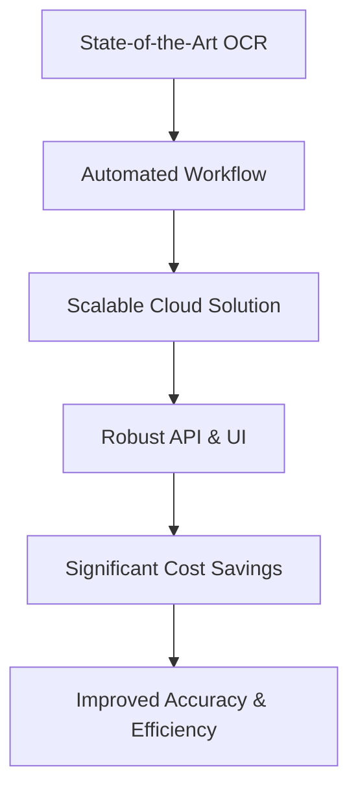
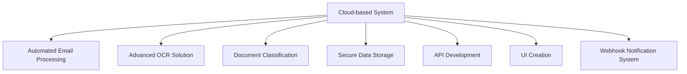
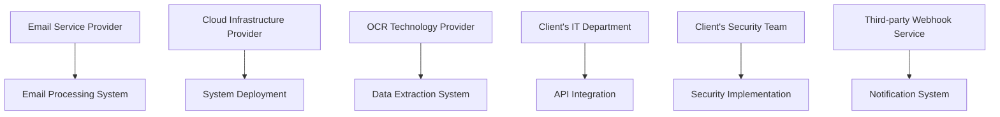
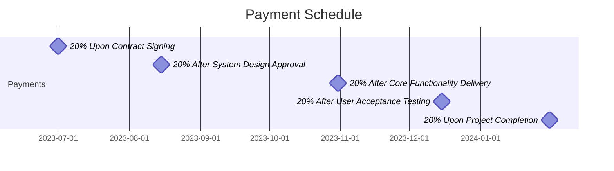
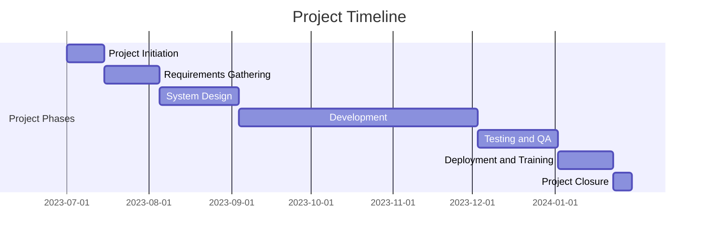
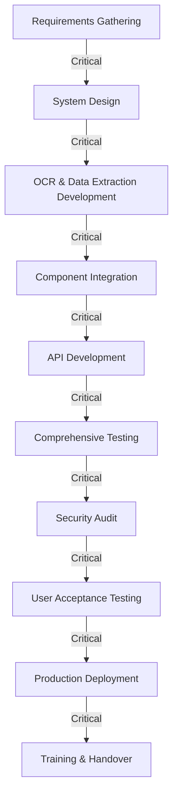
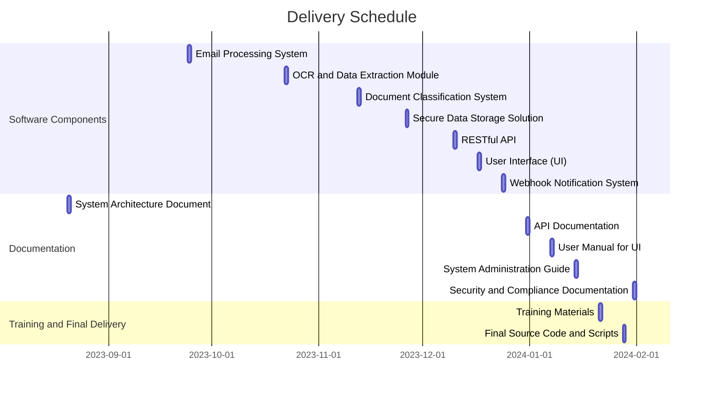

## EXECUTIVE SUMMARY

### PROJECT OVERVIEW

Dollar Funding, a Merchant Cash Advance (MCA) provider, seeks to automate their application processing workflow. Currently relying on a 30-person data entry team, they aim to digitize and streamline the process of handling MCA applications received via email. The proposed cloud-based solution will automatically extract, classify, and store application data from email attachments, significantly reducing manual labor and improving efficiency.

### OBJECTIVES

1. Automate email processing and data extraction from MCA applications
2. Classify and securely store application documents
3. Extract and store key merchant, funding, and owner information
4. Implement a notification system for processed applications
5. Develop a user-friendly API and UI for client interaction
6. Reduce manual data entry workforce by 93% (from 30 to 2 employees)

### VALUE PROPOSITION

Our agency offers a cutting-edge solution that combines advanced technologies to deliver unparalleled value to Dollar Funding:

1. **Advanced OCR Technology**: Our specialized OCR solution can handle imperfections in applications, including hand-written forms and poorly scanned documents, ensuring high accuracy in data extraction.

2. **End-to-End Automation**: From email processing to data extraction and storage, our solution automates the entire workflow, dramatically reducing processing time and human error.

3. **Scalability and Availability**: Built on a cloud infrastructure, our solution can easily scale to handle increasing volumes of applications while maintaining high availability.

4. **Flexible Integration**: With both API and UI interfaces, our solution offers seamless integration into Dollar Funding's existing systems and processes.

5. **Cost Efficiency**: By reducing the data entry team from 30 to 2 employees, our solution offers significant long-term cost savings in human resources.

6. **Enhanced Security**: Our solution implements secure storage and access controls, ensuring the confidentiality and integrity of sensitive application data.

7. **Continuous Improvement**: Our AI-driven OCR technology continuously learns and improves, adapting to new document formats and handwriting styles over time.

By implementing our solution, Dollar Funding will transform its MCA application processing, achieving unprecedented levels of efficiency, accuracy, and cost-effectiveness in their operations.

## PROJECT OBJECTIVES

### BUSINESS GOALS

1. Streamline MCA application processing workflow
2. Reduce operational costs associated with manual data entry
3. Improve application processing speed and efficiency
4. Enhance accuracy of data extraction and classification
5. Increase scalability to handle growing application volumes
6. Improve broker and client satisfaction through faster turnaround times

### TECHNICAL GOALS

1. Implement a cloud-based automated email processing system
2. Develop a state-of-the-art OCR solution for accurate data extraction
3. Create a robust document classification system
4. Design and implement a secure data storage solution
5. Develop a flexible API for seamless integration with existing systems
6. Create a user-friendly UI for application management and webhook configuration
7. Implement a reliable notification system using webhooks

### SUCCESS CRITERIA

| Criteria | Target | Measurement Method |
|----------|--------|---------------------|
| Reduction in manual data entry workforce | 93% (from 30 to 2 employees) | HR records |
| Application processing time | ≤ 5 minutes per application | System logs |
| Data extraction accuracy | ≥ 99% | Quality assurance audits |
| System availability | 99.9% uptime | Monitoring tools |
| API response time | ≤ 200ms for 95% of requests | Performance testing |
| User satisfaction (UI) | ≥ 4.5/5 rating | User surveys |
| Successful webhook notifications | ≥ 99.5% delivery rate | System logs |
| Document classification accuracy | ≥ 98% | Quality assurance audits |
| Cost savings | ≥ 80% reduction in operational costs | Financial analysis |
| Scalability | Handle 200% increase in application volume without performance degradation | Load testing |

## SCOPE OF WORK

### IN-SCOPE

1. Email Processing System
   - Automated retrieval of emails from submissions@dollarfunding.com
   - Extraction and storage of email metadata (sender, body, subject)
   - Tracking of application status (Processing, Ready, Failed)

2. Document Handling and Classification
   - Extraction of PDF attachments from emails
   - Classification of documents (ISO application, bank statements, voided cheques)
   - Secure storage of documents in accessible cloud storage

3. Advanced OCR and Data Extraction
   - Implementation of state-of-the-art OCR technology
   - Extraction of text information from ISO applications
   - Identification and extraction of:
     - Merchant details (Business legal name, DBA name, Federal Tax ID/EIN, Address, Industry, Revenue)
     - Funding details (Funding requested, use of funds)
     - Owner information (Name, SSN, Address, Date of Birth, ownership percentage)
   - Support for imperfections (hand-written applications, poorly scanned documents)

4. Data Storage and Management
   - Design and implementation of secure database for storing extracted data
   - Implementation of data access controls and encryption

5. Notification System
   - Development of webhook-based notification system
   - Notifications for processed applications and applications needing review

6. API Development
   - Creation of RESTful API for client integration
   - Endpoints for application data retrieval, webhook management, and document access

7. User Interface (UI) Development
   - Creation of user-friendly web interface
   - Features for viewing application information and attachments
   - Webhook management (registration, editing, viewing)

8. Scalability and Availability
   - Implementation of cloud-based architecture for high availability
   - Design for scalability to handle increasing application volumes

9. Security Implementation
   - Secure data transmission and storage
   - Implementation of access controls and authentication mechanisms

10. Testing and Quality Assurance
    - Comprehensive testing of all system components
    - Performance testing and optimization

11. Documentation and Training
    - Creation of user manuals and API documentation
    - Provision of training materials for client's staff

### OUT-OF-SCOPE

1. Integration with Dollar Funding's internal systems beyond provided API and UI
2. Development of mobile applications
3. Processing of non-PDF document formats
4. Automated decision-making or approval processes for MCA applications
5. Long-term data archiving or compliance management
6. Custom reporting or analytics beyond basic application status and processing metrics
7. Support for languages other than English
8. Handling of email communications outside of the submissions@dollarfunding.com address

### ASSUMPTIONS

1. Dollar Funding will provide timely access to the submissions@dollarfunding.com email account
2. The client will make available sample applications and documents for system training and testing
3. Dollar Funding will assign a dedicated point of contact for the duration of the project
4. The existing 30-person data entry team will be available for knowledge transfer and system validation
5. The client will provide necessary information for security compliance and data handling requirements
6. Third-party OCR and cloud services will remain available and maintain their current level of functionality
7. The volume of applications will not exceed 200% of current levels during the initial implementation phase

### DEPENDENCIES

1. Email Service Provider: Reliable access to the submissions@dollarfunding.com account is crucial for system functionality
2. Cloud Infrastructure Provider: The project relies on the availability and performance of the chosen cloud platform
3. OCR Technology Provider: The accuracy and efficiency of data extraction depend on the OCR technology's capabilities
4. Client's IT Department: Successful API integration and UI deployment require cooperation from Dollar Funding's IT team
5. Client's Security Team: Implementation of security measures depends on input and approval from the client's security experts
6. Third-party Webhook Service: The notification system's reliability is contingent on the chosen webhook service provider
7. Regulatory Compliance: Any changes in data protection regulations may impact the project's security implementation
8. Hardware Availability: Timely procurement of any required hardware for on-premises components (if applicable)

## BUDGET AND COST ESTIMATES

### COST BREAKDOWN

The following table provides a detailed breakdown of the project costs:

| Category | Item | Cost (USD) |
|----------|------|------------|
| Labor | Project Manager (6 months) | $72,000 |
| Labor | Senior Software Engineers (3 x 6 months) | $270,000 |
| Labor | UI/UX Designer (3 months) | $36,000 |
| Labor | QA Engineer (4 months) | $40,000 |
| Labor | DevOps Engineer (4 months) | $48,000 |
| Infrastructure | Cloud Services (1 year) | $60,000 |
| Software | OCR Technology License | $25,000 |
| Software | Development Tools and Libraries | $10,000 |
| Hardware | Development and Testing Equipment | $15,000 |
| Miscellaneous | Training and Documentation | $20,000 |
| Miscellaneous | Contingency (10%) | $59,600 |
| **Total** |  | **$655,600** |

### PAYMENT SCHEDULE

The proposed payment schedule is tied to project milestones:

1. 20% ($131,120) upon contract signing
2. 20% ($131,120) after system design approval
3. 20% ($131,120) after delivery of core functionality (email processing, OCR, data extraction)
4. 20% ($131,120) after successful user acceptance testing
5. 20% ($131,120) upon project completion and final delivery

### BUDGET CONSIDERATIONS

Several factors could potentially impact the budget:

1. **OCR Accuracy Improvements**: If the initial OCR solution doesn't meet the required accuracy levels, additional investment in more advanced OCR technology or machine learning models may be necessary.

2. **Scalability Challenges**: As the system scales to handle increasing volumes of applications, additional cloud resources may be required, potentially increasing infrastructure costs.

3. **Security and Compliance**: Changes in data protection regulations or additional security requirements may necessitate extra development work or the implementation of additional security measures.

4. **Integration Complexities**: Unforeseen challenges in integrating with Dollar Funding's existing systems could require additional development time and resources.

5. **Data Migration**: If historical data needs to be migrated into the new system, this could add to the project scope and cost.

To manage these potential risks:

- We've included a 10% contingency in the budget to cover unforeseen expenses.
- Regular project status meetings will be held to identify and address any issues early.
- The modular design of the system allows for flexibility in adjusting or enhancing specific components without impacting the entire project.
- We will work closely with Dollar Funding's IT and security teams to ensure all integration and compliance requirements are met from the outset.
- Clear communication channels will be established to quickly address and resolve any budget-related concerns as they arise.

By carefully monitoring these considerations and maintaining open communication with Dollar Funding, we aim to deliver the project within the proposed budget while meeting all specified requirements.

## TIMELINE AND MILESTONES

### PROJECT TIMELINE

The project is estimated to take 6 months from initiation to completion. Here's a high-level timeline outlining the major phases:

### KEY MILESTONES

| Milestone | Description | Target Date |
|-----------|-------------|-------------|
| M1: Project Kickoff | Project team assembled, initial planning completed | 2023-07-07 |
| M2: Requirements Approval | Detailed requirements document signed off by client | 2023-08-04 |
| M3: System Design Approval | Architecture and detailed design documents approved | 2023-09-03 |
| M4: Email Processing Module Complete | Automated email retrieval and metadata extraction functional | 2023-09-24 |
| M5: OCR and Data Extraction Module Complete | Advanced OCR implemented with high accuracy data extraction | 2023-10-22 |
| M6: Document Classification System Complete | Accurate classification of different document types achieved | 2023-11-12 |
| M7: API and UI Development Complete | Fully functional API and user interface delivered | 2023-12-03 |
| M8: Testing Phase Complete | All modules tested, integrated, and passing QA | 2024-01-01 |
| M9: System Deployment | Solution deployed to production environment | 2024-01-22 |
| M10: Project Handover | Training completed, documentation delivered, project closed | 2024-01-31 |

### CRITICAL PATH

The following tasks and activities are critical to keeping the project on schedule:

1. Requirements gathering and approval
2. System architecture and design
3. Development of core OCR and data extraction module
4. Integration of email processing, OCR, and data storage components
5. API development and integration with client systems
6. Comprehensive testing and bug fixing
7. Security audit and compliance verification
8. User acceptance testing
9. Production deployment and data migration (if applicable)
10. Staff training and system handover

To ensure the project stays on track:

1. Regular status meetings will be held to monitor progress on critical path items.
2. Any delays in critical path tasks will be immediately escalated and addressed.
3. Resources will be prioritized for critical path activities.
4. Parallel development of non-critical path items will be utilized where possible to optimize the timeline.
5. Continuous risk assessment and mitigation strategies will be employed throughout the project lifecycle.

## DELIVERABLES

### LIST OF DELIVERABLES

1. Software Components
   - Automated Email Processing System
   - Advanced OCR and Data Extraction Module
   - Document Classification System
   - Secure Data Storage Solution
   - RESTful API
   - User Interface (UI)
   - Webhook Notification System

2. Documentation
   - System Architecture Document
   - Detailed Technical Specifications
   - API Documentation
   - User Manual for UI
   - System Administration Guide
   - Security and Compliance Documentation

3. Training Materials
   - User Training Guide
   - API Integration Guide
   - Video Tutorials for UI and API Usage

4. Other Deliverables
   - Source Code Repository
   - Deployment Scripts and Configuration Files
   - Test Cases and Test Results
   - Performance Benchmark Reports

### DELIVERY SCHEDULE

| Deliverable | Expected Delivery Date |
|-------------|------------------------|
| System Architecture Document | 2023-08-20 |
| Email Processing System | 2023-09-24 |
| OCR and Data Extraction Module | 2023-10-22 |
| Document Classification System | 2023-11-12 |
| Secure Data Storage Solution | 2023-11-26 |
| RESTful API | 2023-12-10 |
| User Interface (UI) | 2023-12-17 |
| Webhook Notification System | 2023-12-24 |
| API Documentation | 2023-12-31 |
| User Manual for UI | 2024-01-07 |
| System Administration Guide | 2024-01-14 |
| Training Materials | 2024-01-21 |
| Final Source Code and Deployment Scripts | 2024-01-28 |
| Security and Compliance Documentation | 2024-01-31 |

### ACCEPTANCE CRITERIA

1. Automated Email Processing System
   - Successfully retrieves emails from submissions@dollarfunding.com
   - Extracts and stores email metadata with 100% accuracy
   - Tracks application status correctly

2. Advanced OCR and Data Extraction Module
   - Achieves ≥99% accuracy in data extraction from ISO applications
   - Successfully handles imperfections like handwritten text and poor scans
   - Correctly identifies and extracts all required merchant, funding, and owner information

3. Document Classification System
   - Accurately classifies ≥98% of documents (ISO applications, bank statements, voided cheques)

4. Secure Data Storage Solution
   - Implements industry-standard encryption for data at rest and in transit
   - Provides secure access controls
   - Passes security audit by client's IT team

5. RESTful API
   - Provides all required endpoints for application data retrieval, webhook management, and document access
   - Achieves ≤200ms response time for 95% of requests under load testing
   - Includes comprehensive error handling and logging

6. User Interface (UI)
   - Provides all specified functionality (viewing application information, managing webhooks, etc.)
   - Achieves a user satisfaction rating of ≥4.5/5 in client usability testing

7. Webhook Notification System
   - Successfully delivers ≥99.5% of notifications
   - Allows for easy registration, editing, and viewing of webhooks

8. Documentation
   - Comprehensive and accurate coverage of all system components and processes
   - Approved by client's technical team for clarity and completeness

9. Training Materials
   - Cover all aspects of system usage and API integration
   - Successfully used to train client's staff with minimal additional support required

10. Overall System Performance
    - Processes ≥95% of applications within 5 minutes
    - Maintains 99.9% uptime during a 30-day monitoring period
    - Scales to handle a 200% increase in application volume without performance degradation

Each deliverable will be subject to a formal review and approval process by the client. Any issues or discrepancies will be addressed before the deliverable is considered accepted.