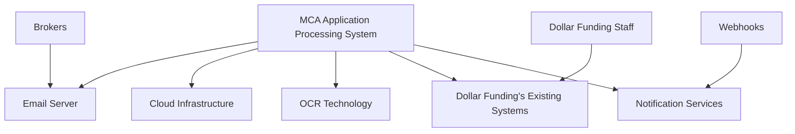
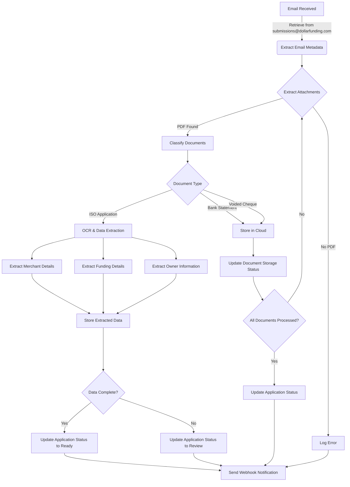
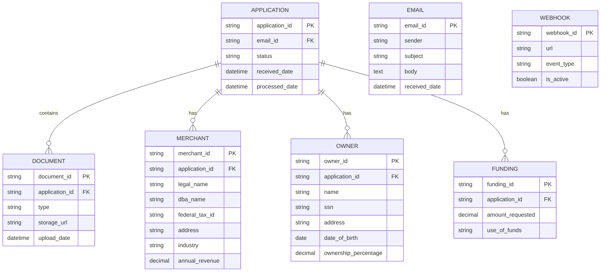
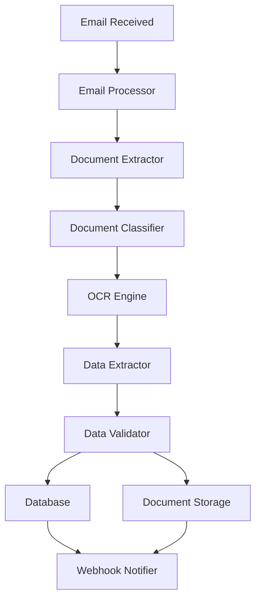

## INTRODUCTION

### PURPOSE

The purpose of this Software Requirements Specification (SRS) document is to provide a comprehensive and detailed description of the cloud-based Merchant Cash Advance (MCA) application processing system for Dollar Funding. This document serves as a definitive guide for the development team, project stakeholders, and client representatives, outlining the functional and non-functional requirements, system architecture, and performance specifications of the proposed solution.

This SRS is intended for the following audience:

1. Development Team: To understand the technical requirements and guide the implementation process.
2. Project Managers: To plan resources, timelines, and milestones based on the outlined specifications.
3. Quality Assurance Team: To develop test plans and ensure the final product meets all stated requirements.
4. Dollar Funding Stakeholders: To review and approve the proposed solution's functionality and scope.
5. System Administrators: To understand the deployment and maintenance requirements of the system.
6. Future Maintainers: To comprehend the system's architecture and functionality for long-term support and enhancements.

### SCOPE

The MCA application processing system is a cloud-based solution designed to automate and streamline Dollar Funding's current manual process for handling Merchant Cash Advance applications. The system aims to significantly reduce the reliance on manual data entry, improve processing efficiency, and enhance the accuracy of information extraction from application documents.

Key goals and benefits of the system include:

1. Automation of email processing and data extraction from MCA applications
2. Reduction of manual data entry workforce by 93% (from 30 to 2 employees)
3. Improvement in application processing speed and accuracy
4. Enhanced scalability to handle increasing application volumes
5. Improved security and compliance in handling sensitive financial information
6. Increased client satisfaction through faster turnaround times

Core functionalities of the system include:

1. Automated Email Processing:
   - Retrieval of emails from submissions@dollarfunding.com
   - Extraction and storage of email metadata
   - Tracking of application status

2. Advanced OCR and Data Extraction:
   - Implementation of state-of-the-art OCR technology
   - Extraction of text information from ISO applications
   - Identification and extraction of merchant, funding, and owner information
   - Support for imperfections in applications (e.g., handwritten forms, poor scans)

3. Document Classification:
   - Accurate classification of different document types (ISO applications, bank statements, voided cheques)

4. Secure Data Storage:
   - Implementation of a secure database for storing extracted data
   - Secure cloud storage for application documents

5. Notification System:
   - Development of a webhook-based notification system for processed applications and those needing review

6. API and User Interface:
   - Creation of a RESTful API for client integration
   - Development of a user-friendly web interface for application management and webhook configuration

7. Scalability and Availability:
   - Implementation of a cloud-based architecture for high availability and scalability

The system will be built using modern cloud technologies, incorporating advanced OCR solutions, and following best practices in security and data protection. It will integrate seamlessly with Dollar Funding's existing workflows while providing a flexible foundation for future enhancements and scaling.

## PRODUCT DESCRIPTION

### PRODUCT PERSPECTIVE

The cloud-based Merchant Cash Advance (MCA) application processing system is designed to integrate seamlessly into Dollar Funding's existing operational workflow. It serves as a central hub for automating the intake, processing, and management of MCA applications, replacing the current manual process. The system interacts with the following external entities:

1. Email Server: Interfaces with the submissions@dollarfunding.com email account to retrieve incoming applications.
2. Cloud Infrastructure: Utilizes cloud services for scalable computing resources, storage, and database management.
3. OCR Technology: Integrates with advanced OCR solutions for accurate data extraction from various document types.
4. Dollar Funding's Existing Systems: Provides API endpoints for integration with the client's current software ecosystem.
5. Notification Services: Utilizes webhook technology to send real-time updates to relevant stakeholders.

### PRODUCT FUNCTIONS

The MCA application processing system will perform the following key functions:

1. Automated Email Processing:
   - Retrieve emails from submissions@dollarfunding.com
   - Extract and store email metadata (sender, subject, body)
   - Track application status (Processing, Ready, Failed)

2. Document Handling and Classification:
   - Extract PDF attachments from emails
   - Classify documents (ISO application, bank statements, voided cheques)
   - Store documents securely in cloud storage

3. Advanced OCR and Data Extraction:
   - Extract text information from ISO applications
   - Identify and extract merchant details (Business name, Tax ID, Address, etc.)
   - Extract funding details and owner information
   - Handle imperfections in applications (handwritten text, poor scans)

4. Secure Data Management:
   - Store extracted data in a secure database
   - Implement data access controls and encryption

5. Notification System:
   - Send webhook notifications for processed applications
   - Alert when applications need review (e.g., missing SSN or tax ID)

6. API and User Interface:
   - Provide RESTful API for client integration
   - Offer web-based UI for application management and webhook configuration

7. Scalability and Availability:
   - Ensure high availability through cloud-based architecture
   - Scale to handle increasing application volumes

### USER CHARACTERISTICS

The system is designed to cater to three primary user groups:

1. Data Entry Specialists:
   - Expertise: Moderate technical skills, familiar with MCA application processing
   - Responsibilities: Review and manage processed applications, handle exceptions
   - Persona: Sarah, 35, has 5 years of experience in data entry and basic IT skills

2. IT Administrators:
   - Expertise: High technical proficiency, experienced in system administration and API integration
   - Responsibilities: Manage system configuration, monitor performance, integrate with existing systems
   - Persona: Alex, 42, senior IT administrator with 15 years of experience in financial software systems

3. Management/Executives:
   - Expertise: Limited technical skills, high business acumen
   - Responsibilities: Review performance metrics, make strategic decisions based on system outputs
   - Persona: Michael, 50, COO with 20 years in the financial industry, focuses on operational efficiency

### CONSTRAINTS

1. Regulatory Compliance:
   - Must adhere to financial data protection regulations (e.g., GDPR, CCPA)
   - Ensure compliance with industry-specific regulations for MCA providers

2. Technical Limitations:
   - System must be compatible with Dollar Funding's existing email infrastructure
   - OCR accuracy dependent on the quality of submitted documents

3. Performance Requirements:
   - Process applications within 5 minutes
   - Handle a 200% increase in current application volume without degradation

4. Security Constraints:
   - Implement industry-standard encryption for data at rest and in transit
   - Adhere to strict access control and authentication mechanisms

5. Budgetary Constraints:
   - Development and implementation costs not to exceed $655,600
   - Ongoing operational costs must result in net savings compared to current manual process

6. Time Constraints:
   - System must be fully operational within 6 months from project initiation

### ASSUMPTIONS AND DEPENDENCIES

Assumptions:
1. Dollar Funding will provide timely access to the submissions@dollarfunding.com email account
2. The volume of applications will not exceed 200% of current levels during the initial implementation phase
3. Dollar Funding's existing systems can integrate with RESTful APIs
4. The current data entry team will be available for knowledge transfer and system validation
5. Sample applications and documents will be provided for system training and testing

Dependencies:
1. Email Service Provider: Reliable access to the submissions@dollarfunding.com account
2. Cloud Infrastructure Provider: Availability and performance of the chosen cloud platform
3. OCR Technology Provider: Accuracy and efficiency of the OCR solution
4. Dollar Funding's IT Department: Cooperation for API integration and security implementation
5. Third-party Webhook Service: Reliability of the chosen notification service
6. Regulatory Environment: Stability of current data protection and financial regulations
7. Hardware Procurement: Timely availability of any required on-premises hardware components

The success of the project relies on these assumptions holding true and the timely resolution of any issues related to the identified dependencies.

## PROCESS FLOWCHART

The following flowchart illustrates the high-level process flow of the MCA application processing system:

This flowchart outlines the following key processes:

1. Email Retrieval: The system retrieves emails from submissions@dollarfunding.com.

2. Metadata Extraction: Email metadata is extracted and stored.

3. Attachment Processing: PDF attachments are extracted from the email.

4. Document Classification: The system classifies the extracted documents into ISO applications, bank statements, and voided cheques.

5. OCR and Data Extraction: For ISO applications, the advanced OCR technology extracts relevant data.

6. Data Storage: Extracted data is stored in the secure database, while documents are stored in cloud storage.

7. Application Status Update: The system updates the application status based on the completeness of data.

8. Notification: Webhook notifications are sent for processed applications or those needing review.

The process is designed to be automated, scalable, and efficient, aligning with the project's goals of reducing manual intervention and improving processing speed. The flowchart demonstrates the system's ability to handle various document types and scenarios, ensuring a comprehensive approach to MCA application processing.

Based on the provided information and maintaining consistency with previous technology and framework choices, here's a breakdown of the product features with the requested sub-sections:

1. Automated Email Processing

ID: F001
DESCRIPTION: Automatically retrieve and process emails from submissions@dollarfunding.com, extracting metadata and tracking application status.
PRIORITY: High

| Requirement ID | Requirement Description |
|----------------|--------------------------|
| F001-1 | Retrieve emails from submissions@dollarfunding.com at regular intervals |
| F001-2 | Extract email metadata (sender, subject, body) |
| F001-3 | Store email metadata in the secure database |
| F001-4 | Track application status (Processing, Ready, Failed) |
| F001-5 | Handle email attachments and prepare them for further processing |

2. Document Classification

ID: F002
DESCRIPTION: Classify incoming documents as ISO applications, bank statements, or voided cheques using advanced machine learning algorithms.
PRIORITY: High

| Requirement ID | Requirement Description |
|----------------|--------------------------|
| F002-1 | Implement machine learning model for document classification |
| F002-2 | Achieve ≥98% accuracy in document classification |
| F002-3 | Handle various document formats and qualities |
| F002-4 | Integrate with the email processing system to receive documents |
| F002-5 | Prepare classified documents for appropriate processing pipelines |

3. Advanced OCR and Data Extraction

ID: F003
DESCRIPTION: Utilize state-of-the-art OCR technology to extract text and relevant information from ISO applications, including handwritten and poorly scanned documents.
PRIORITY: Critical

| Requirement ID | Requirement Description |
|----------------|--------------------------|
| F003-1 | Implement advanced OCR technology capable of handling imperfections |
| F003-2 | Extract merchant details (Business name, Tax ID, Address, etc.) |
| F003-3 | Extract funding details (Amount requested, use of funds) |
| F003-4 | Extract owner information (Name, SSN, DOB, etc.) |
| F003-5 | Achieve ≥99% accuracy in data extraction |
| F003-6 | Handle handwritten applications and poor quality scans |

4. Secure Data Storage

ID: F004
DESCRIPTION: Implement a secure, scalable cloud-based storage solution for both extracted data and original documents.
PRIORITY: High

| Requirement ID | Requirement Description |
|----------------|--------------------------|
| F004-1 | Design and implement a secure database for storing extracted data |
| F004-2 | Set up secure cloud storage for original documents |
| F004-3 | Implement encryption for data at rest and in transit |
| F004-4 | Establish access controls and authentication mechanisms |
| F004-5 | Ensure compliance with relevant data protection regulations |

5. RESTful API

ID: F005
DESCRIPTION: Develop a comprehensive RESTful API for client integration, allowing access to processed application data and document management.
PRIORITY: High

| Requirement ID | Requirement Description |
|----------------|--------------------------|
| F005-1 | Design and implement RESTful API endpoints for all core functionalities |
| F005-2 | Include endpoints for application data retrieval |
| F005-3 | Provide endpoints for document access and management |
| F005-4 | Implement robust error handling and logging |
| F005-5 | Ensure API response time ≤200ms for 95% of requests |

6. User Interface (UI)

ID: F006
DESCRIPTION: Create a user-friendly web interface for application management, document viewing, and webhook configuration.
PRIORITY: Medium

| Requirement ID | Requirement Description |
|----------------|--------------------------|
| F006-1 | Develop a responsive web interface for application management |
| F006-2 | Implement features for viewing application information and attachments |
| F006-3 | Create interface for webhook management (registration, editing, viewing) |
| F006-4 | Ensure intuitive navigation and user experience |
| F006-5 | Implement role-based access control for different user types |

7. Webhook Notification System

ID: F007
DESCRIPTION: Develop a reliable webhook-based notification system for processed applications and those needing review.
PRIORITY: Medium

| Requirement ID | Requirement Description |
|----------------|--------------------------|
| F007-1 | Implement webhook registration and management system |
| F007-2 | Develop notification triggers for processed applications |
| F007-3 | Create alerts for applications needing review (e.g., missing SSN or tax ID) |
| F007-4 | Ensure ≥99.5% successful delivery rate for notifications |
| F007-5 | Implement retry mechanism for failed webhook deliveries |

8. Scalability and Performance

ID: F008
DESCRIPTION: Ensure the system is highly available, scalable, and performs efficiently under increasing load.
PRIORITY: High

| Requirement ID | Requirement Description |
|----------------|--------------------------|
| F008-1 | Implement cloud-based architecture for high availability |
| F008-2 | Ensure system can handle 200% increase in current application volume |
| F008-3 | Maintain 99.9% uptime |
| F008-4 | Process applications within 5 minutes |
| F008-5 | Implement auto-scaling for cloud resources based on load |

9. Security and Compliance

ID: F009
DESCRIPTION: Implement robust security measures and ensure compliance with relevant financial and data protection regulations.
PRIORITY: Critical

| Requirement ID | Requirement Description |
|----------------|--------------------------|
| F009-1 | Implement end-to-end encryption for data transmission |
| F009-2 | Ensure compliance with financial data protection regulations (e.g., GDPR, CCPA) |
| F009-3 | Implement multi-factor authentication for system access |
| F009-4 | Conduct regular security audits and penetration testing |
| F009-5 | Implement comprehensive logging and monitoring for security events |

## NON-FUNCTIONAL REQUIREMENTS

### PERFORMANCE

1. Response Time
   - API response time shall be ≤200ms for 95% of requests under normal load conditions.
   - Email processing and data extraction shall be completed within 5 minutes for 95% of applications.
   - Document classification shall be performed in ≤2 seconds per document.

2. Throughput
   - The system shall handle a minimum of 1000 concurrent users without performance degradation.
   - The system shall process at least 10,000 applications per day.

3. Resource Usage
   - CPU utilization shall not exceed 70% during peak loads.
   - Memory usage shall not exceed 80% of available RAM during normal operations.
   - Database queries shall be optimized to execute within 100ms for 90% of queries.

### SAFETY

1. Data Backup
   - The system shall perform automated daily backups of all application data and documents.
   - Backups shall be stored in geographically diverse locations to ensure data recovery in case of disaster.

2. Fault Tolerance
   - The system shall implement redundancy for critical components to ensure continuous operation in case of hardware failure.
   - In the event of a system crash, the application shall automatically restart within 60 seconds.

3. Error Handling
   - The system shall log all errors and exceptions with appropriate severity levels.
   - Critical errors shall trigger immediate notifications to the system administrators.

4. Data Integrity
   - The system shall implement transaction management to ensure data consistency in case of process failures.
   - Regular data integrity checks shall be performed to detect and report any data corruption.

### SECURITY

1. Authentication
   - The system shall implement multi-factor authentication for all user accounts.
   - Failed login attempts shall be limited to 5 consecutive failures before temporarily locking the account.

2. Authorization
   - The system shall implement role-based access control (RBAC) to restrict access to sensitive data and functions.
   - All API endpoints shall require valid authentication tokens for access.

3. Data Encryption
   - All data transmissions shall use TLS 1.3 or higher for encryption.
   - Sensitive data at rest, including SSNs and Tax IDs, shall be encrypted using AES-256 encryption.

4. Privacy
   - The system shall comply with GDPR and CCPA requirements for data privacy and user consent.
   - Personal Identifiable Information (PII) shall be masked or tokenized when displayed in the UI.

5. Audit Logging
   - The system shall maintain a comprehensive audit log of all user actions and system events.
   - Audit logs shall be tamper-proof and retained for a minimum of 2 years.

### QUALITY

1. Availability
   - The system shall maintain 99.9% uptime, allowing for no more than 8.76 hours of downtime per year.
   - Planned maintenance shall be scheduled during off-peak hours and not exceed 4 hours per month.

2. Maintainability
   - The system shall be designed with modular architecture to facilitate easy updates and maintenance.
   - Code documentation shall be maintained with a minimum of 80% code coverage.
   - The system shall support automated deployment and rollback procedures.

3. Usability
   - The user interface shall be responsive and compatible with major browsers (Chrome, Firefox, Safari, Edge).
   - The system shall provide clear error messages and guided workflows for common tasks.
   - The UI shall be designed to be intuitive, requiring no more than 2 hours of training for new users.

4. Scalability
   - The system shall be capable of handling a 200% increase in application volume without significant performance degradation.
   - The cloud infrastructure shall support automatic scaling based on predefined metrics.

5. Reliability
   - The Mean Time Between Failures (MTBF) for the system shall be at least 720 hours (30 days).
   - The Mean Time To Recover (MTTR) from a system failure shall not exceed 1 hour.

### COMPLIANCE

1. Legal Compliance
   - The system shall comply with all applicable financial regulations, including Know Your Customer (KYC) and Anti-Money Laundering (AML) requirements.
   - The system shall adhere to data retention policies as mandated by financial regulations.

2. Regulatory Compliance
   - The system shall comply with PCI DSS standards for handling and storing financial information.
   - Regular compliance audits shall be conducted and documented.

3. Standards Compliance
   - The system shall adhere to OWASP Top 10 security guidelines for web applications.
   - API development shall follow RESTful design principles and OpenAPI Specification 3.0.

4. Accessibility Compliance
   - The user interface shall comply with WCAG 2.1 Level AA standards for accessibility.

5. Data Protection Compliance
   - The system shall implement data protection measures in compliance with GDPR and CCPA.
   - Data subject access requests shall be fulfilled within the timeframes specified by applicable regulations.

These non-functional requirements ensure that the MCA application processing system for Dollar Funding meets high standards of performance, safety, security, quality, and compliance. They complement the functional requirements by addressing critical aspects of system behavior, reliability, and regulatory adherence.

## DATA REQUIREMENTS

### DATA MODELS

The MCA application processing system will utilize the following data models to efficiently store and manage information:

This entity-relationship diagram illustrates the relationships between the main entities in the system. The APPLICATION entity serves as the central point, linking to related entities such as DOCUMENT, MERCHANT, OWNER, and FUNDING. The EMAIL entity stores information about the original email submission, while the WEBHOOK entity manages notification configurations.

### DATA STORAGE

1. Database Selection:
   - Primary Database: Amazon Aurora PostgreSQL for its high performance, scalability, and compatibility with PostgreSQL.
   - Document Storage: Amazon S3 for secure, durable, and scalable object storage of application documents.

2. Data Retention:
   - Application data will be retained for 7 years to comply with financial regulations.
   - Processed emails will be retained for 90 days before being archived.
   - Document retention periods will be configurable based on document type and regulatory requirements.

3. Redundancy:
   - Amazon Aurora provides built-in replication across multiple Availability Zones.
   - S3 offers 99.999999999% durability across multiple facilities.

4. Backup:
   - Daily automated backups of the Aurora database with point-in-time recovery for the last 35 days.
   - Weekly full backups stored in Amazon S3 with lifecycle policies for long-term retention.
   - S3 versioning enabled for document storage to allow for easy recovery of previous versions.

5. Recovery:
   - Automated failover to a secondary Aurora instance in case of primary instance failure.
   - Database recovery procedures will be documented and tested regularly.
   - S3 cross-region replication will be implemented for disaster recovery scenarios.

6. Scalability:
   - Aurora's auto-scaling feature will be utilized to handle increased database load.
   - S3's virtually unlimited storage capacity will accommodate growing document volumes.

### DATA PROCESSING

1. Data Flow:

2. Data Security:

   a. Encryption:
      - Data at rest: AES-256 encryption for database and S3 storage.
      - Data in transit: TLS 1.3 for all network communications.

   b. Access Control:
      - IAM roles and policies for AWS services access.
      - Role-based access control (RBAC) for application users.
      - Multi-factor authentication (MFA) for administrative access.

   c. Data Masking:
      - Sensitive information (e.g., SSN, Tax ID) will be masked in logs and user interfaces.

   d. Audit Logging:
      - Comprehensive logging of all data access and modifications.
      - Use of AWS CloudTrail for AWS API call logging.

3. Data Validation:
   - Input validation on all API endpoints and user interfaces.
   - Data type and format validation before storage.
   - Business rule validation (e.g., ownership percentage totals, valid tax ID formats).

4. Data Transformation:
   - OCR engine output will be normalized and structured before storage.
   - Address standardization using a third-party service for consistency.

5. Data Integration:
   - RESTful API endpoints for secure data retrieval and limited updates.
   - Webhook system for real-time notifications of data changes.

6. Data Quality:
   - Automated data quality checks post-processing.
   - Manual review process for applications flagged with potential issues.
   - Periodic data quality audits using automated tools.

7. Compliance:
   - Implementation of data anonymization techniques for testing and development environments.
   - Data access logging for compliance with financial regulations.
   - Regular security assessments and penetration testing of data processing workflows.

This data requirements section ensures that the MCA application processing system handles data efficiently, securely, and in compliance with relevant regulations. The data models provide a clear structure for storing application information, while the storage and processing strategies ensure data integrity, availability, and protection throughout the system's operations.

## EXTERNAL INTERFACES

### USER INTERFACES

The MCA application processing system will provide a web-based user interface accessible through modern web browsers. The interface will be designed with a focus on usability, efficiency, and responsiveness, catering to the needs of data entry specialists, IT administrators, and management/executives.

Key features of the user interface include:

1. Dashboard:
   - Overview of application processing statistics
   - Quick access to recent applications and notifications

2. Application Management:
   - List view of all applications with filtering and sorting options
   - Detailed view of individual applications, including extracted data and document previews

3. Document Viewer:
   - In-browser preview of application documents (ISO applications, bank statements, voided cheques)
   - Ability to zoom, rotate, and navigate multi-page documents

4. Webhook Configuration:
   - Interface for adding, editing, and deleting webhook endpoints
   - Testing tool for webhook notifications

5. User Management:
   - Role-based access control settings
   - User activity logs

6. Settings and Configuration:
   - System-wide settings for OCR sensitivity, notification preferences, etc.

The user interface will be developed using a modern JavaScript framework (e.g., React) to ensure a responsive and interactive experience. It will adhere to WCAG 2.1 Level AA standards for accessibility.

[Placeholder for Dashboard Mockup]

[Placeholder for Application Detail View Mockup]

[Placeholder for Document Viewer Mockup]

[Placeholder for Webhook Configuration Mockup]

### SOFTWARE INTERFACES

The MCA application processing system will interact with various software components and external systems. The following interfaces will be implemented:

1. Email Server Interface:
   - Protocol: IMAP (Internet Message Access Protocol)
   - Purpose: Retrieve emails from submissions@dollarfunding.com
   - Data Format: Email messages (RFC 5322)
   - Security: TLS encryption for secure communication

2. Cloud Storage Interface:
   - Service: Amazon S3 (Simple Storage Service)
   - Purpose: Store and retrieve application documents
   - API: AWS SDK for programmatic access
   - Data Format: Binary (PDF documents)
   - Security: IAM roles and policies for access control

3. Database Interface:
   - Database: Amazon Aurora PostgreSQL
   - Purpose: Store and retrieve application data, user information, and system configurations
   - API: SQL via a database ORM (e.g., SQLAlchemy)
   - Data Format: Structured data (tables and relations)
   - Security: Encrypted connections, parameterized queries to prevent SQL injection

4. OCR Engine Interface:
   - Service: AWS Textract
   - Purpose: Extract text and data from application documents
   - API: AWS SDK for programmatic access
   - Data Format: JSON responses containing extracted text and form data
   - Security: IAM roles and policies for access control

5. Webhook Notification Interface:
   - Protocol: HTTPS
   - Purpose: Send notifications to registered endpoints
   - Data Format: JSON payloads
   - Security: HTTPS encryption, authentication tokens for webhook endpoints

6. RESTful API Interface:
   - Protocol: HTTPS
   - Purpose: Provide programmatic access to application data and system functions
   - Data Format: JSON for request and response payloads
   - Authentication: JWT (JSON Web Tokens) for secure API access
   - Documentation: OpenAPI Specification 3.0

### COMMUNICATION INTERFACES

The MCA application processing system will utilize various communication interfaces to ensure secure and efficient data exchange:

1. HTTPS (TLS 1.3):
   - Purpose: Secure all web-based communications, including UI access and API calls
   - Port: 443
   - Data Format: Encrypted HTTP traffic
   - Security Measures: 
     - TLS 1.3 protocol
     - HSTS (HTTP Strict Transport Security)
     - Certificate pinning for API clients

2. SMTP (Simple Mail Transfer Protocol):
   - Purpose: Send email notifications and alerts
   - Port: 587 (STARTTLS)
   - Data Format: MIME-encoded email messages
   - Security Measures:
     - STARTTLS encryption
     - DKIM (DomainKeys Identified Mail) signatures
     - SPF (Sender Policy Framework) records

3. WebSocket:
   - Purpose: Provide real-time updates to the user interface
   - Port: 443 (over HTTPS)
   - Data Format: JSON messages
   - Security Measures:
     - TLS encryption
     - Token-based authentication for WebSocket connections

4. AWS VPC (Virtual Private Cloud):
   - Purpose: Secure internal communication between system components
   - Protocol: Various (TCP, UDP)
   - Security Measures:
     - Network ACLs
     - Security Groups
     - VPC Endpoints for AWS services

5. AWS Direct Connect (Optional):
   - Purpose: Provide dedicated network connection between Dollar Funding's on-premises network and AWS
   - Bandwidth: To be determined based on data transfer requirements
   - Security Measures:
     - Dedicated private connection
     - BGP (Border Gateway Protocol) for routing

6. DNS (Domain Name System):
   - Purpose: Resolve domain names for the application and API endpoints
   - Protocol: DNS over HTTPS (DoH)
   - Security Measures:
     - DNSSEC (Domain Name System Security Extensions)
     - DNS-based Authentication of Named Entities (DANE)

These communication interfaces ensure secure, efficient, and reliable data exchange between the MCA application processing system components and external entities. All interfaces will be implemented with a focus on security, using encryption, authentication, and access controls to protect sensitive financial data throughout the communication process.

## APPENDICES

### GLOSSARY

- Merchant Cash Advance (MCA): A type of business financing where a company sells a portion of its future credit card sales in exchange for an immediate lump sum payment.
- ISO Application: Independent Sales Organization application, a document used to apply for a Merchant Cash Advance.
- Webhook: A method of augmenting or altering the behavior of a web page or web application with custom callbacks.
- OCR (Optical Character Recognition): Technology that recognizes text within a digital image.
- Data Extraction: The process of retrieving data from various sources for further data processing or data storage.
- Cloud-based: Services, resources, or applications that are hosted and accessed over the internet rather than on local computers or servers.

### ACRONYMS

- API: Application Programming Interface
- AWS: Amazon Web Services
- CCPA: California Consumer Privacy Act
- DBA: Doing Business As
- DoH: DNS over HTTPS
- EIN: Employer Identification Number
- GDPR: General Data Protection Regulation
- HSTS: HTTP Strict Transport Security
- IAM: Identity and Access Management
- IMAP: Internet Message Access Protocol
- JWT: JSON Web Token
- KYC: Know Your Customer
- MFA: Multi-Factor Authentication
- MIME: Multipurpose Internet Mail Extensions
- MTBF: Mean Time Between Failures
- MTTR: Mean Time To Recover
- PCI DSS: Payment Card Industry Data Security Standard
- RBAC: Role-Based Access Control
- REST: Representational State Transfer
- S3: Simple Storage Service
- SMTP: Simple Mail Transfer Protocol
- SPF: Sender Policy Framework
- SQL: Structured Query Language
- SSN: Social Security Number
- TLS: Transport Layer Security
- UI: User Interface
- VPC: Virtual Private Cloud
- WCAG: Web Content Accessibility Guidelines

### ADDITIONAL REFERENCES

1. Amazon Aurora PostgreSQL Documentation:
   https://docs.aws.amazon.com/AmazonRDS/latest/AuroraUserGuide/Aurora.AuroraPostgreSQL.html

2. AWS Textract Developer Guide:
   https://docs.aws.amazon.com/textract/latest/dg/what-is.html

3. React Documentation:
   https://reactjs.org/docs/getting-started.html

4. OpenAPI Specification:
   https://swagger.io/specification/

5. OWASP Top Ten Web Application Security Risks:
   https://owasp.org/www-project-top-ten/

6. WCAG 2.1 Guidelines:
   https://www.w3.org/TR/WCAG21/

7. PostgreSQL Documentation:
   https://www.postgresql.org/docs/

8. AWS Best Practices for Security, Identity, & Compliance:
   https://aws.amazon.com/architecture/security-identity-compliance/

9. Webhook Security: Best Practices:
   https://webhooks.fyi/security/best-practices

10. NIST Guidelines for Media Sanitization:
    https://nvlpubs.nist.gov/nistpubs/SpecialPublications/NIST.SP.800-88r1.pdf

These additional references provide in-depth information on the technologies, frameworks, and best practices mentioned throughout the Software Requirements Specification (SRS) document. They serve as valuable resources for the development team, security specialists, and other stakeholders involved in the implementation and maintenance of the MCA application processing system.