## INTRODUCTION

### SYSTEM OVERVIEW

The Merchant Cash Advance (MCA) application processing system is a comprehensive cloud-based solution designed to automate and streamline the intake, processing, and management of MCA applications for Dollar Funding. This system aims to replace the current manual process, significantly reducing the reliance on human data entry while improving efficiency, accuracy, and scalability.

Key components of the system include:

1. Email Processing Module
2. Document Classification Engine
3. Advanced OCR and Data Extraction Service
4. Secure Data Storage Solution
5. RESTful API
6. Web-based User Interface
7. Webhook Notification System

The following diagram provides a high-level overview of the system architecture:

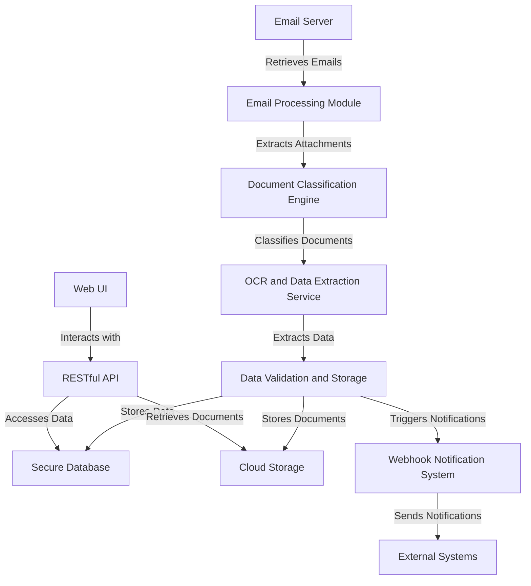

The system is built on a modern, scalable cloud infrastructure using Amazon Web Services (AWS) to ensure high availability, performance, and security. Key technologies and services include:

- Amazon Aurora PostgreSQL for the primary database
- Amazon S3 for document storage
- AWS Textract for OCR and data extraction
- Amazon EC2 for application hosting
- Amazon VPC for network security
- AWS IAM for access control
- Amazon CloudWatch for monitoring and logging

The system is designed to handle the entire lifecycle of an MCA application, from initial email receipt to final processing and notification. It incorporates advanced machine learning algorithms for document classification and state-of-the-art OCR technology to handle various document qualities, including handwritten applications.

Security and compliance are paramount, with the system adhering to financial industry regulations and data protection standards such as GDPR and CCPA. End-to-end encryption, role-based access control, and comprehensive audit logging ensure the confidentiality and integrity of sensitive financial data.

The RESTful API and web-based user interface provide flexible access options for Dollar Funding staff and potential integration with existing systems. The webhook notification system enables real-time updates to relevant stakeholders, enhancing the overall efficiency of the MCA application process.

By automating the majority of the application processing tasks, this system aims to reduce Dollar Funding's reliance on manual data entry by 93%, processing applications faster and more accurately while providing a scalable solution for future growth.

## SYSTEM ARCHITECTURE

### PROGRAMMING LANGUAGES

The MCA application processing system will utilize the following programming languages, chosen for their suitability to specific components and overall system requirements:

| Language | Purpose | Justification |
|----------|---------|---------------|
| Python 3.9+ | Backend services, API development, data processing | - Excellent for rapid development - Rich ecosystem of libraries for data processing and machine learning - Strong support for asynchronous programming - AWS Lambda compatibility |
| JavaScript (ES6+) | Frontend development, Node.js microservices | - Industry standard for web development - React framework for responsive UI - Node.js for lightweight, scalable microservices |
| SQL | Database queries and management | - Standard language for relational database operations - Compatibility with Amazon Aurora PostgreSQL |
| Bash | DevOps scripts, automation | - Efficient for system-level scripting and automation - Native to Unix-based systems in AWS environment |

### HIGH-LEVEL ARCHITECTURE DIAGRAM

The following diagram provides an overview of the system's components and their interactions:

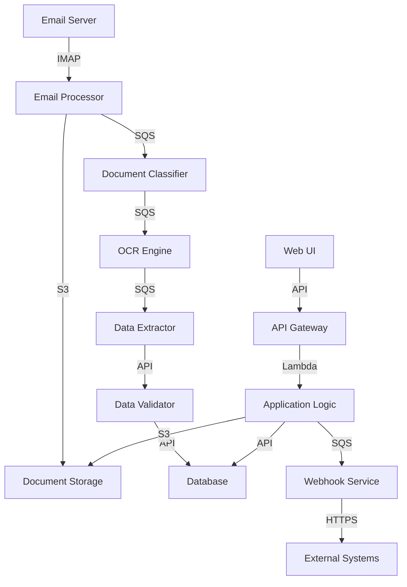

### COMPONENT DIAGRAMS

The following diagram details the specific components within the system and their relationships:

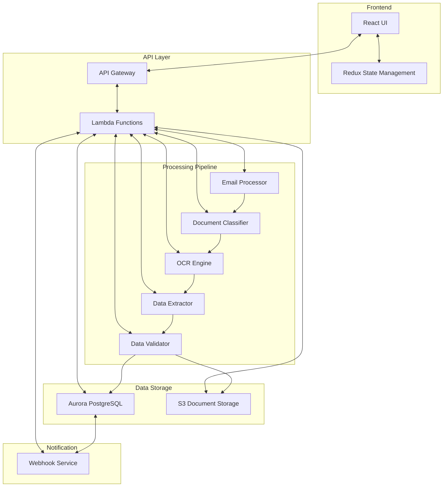

### SEQUENCE DIAGRAMS

The following sequence diagram illustrates the process of receiving and processing an MCA application:

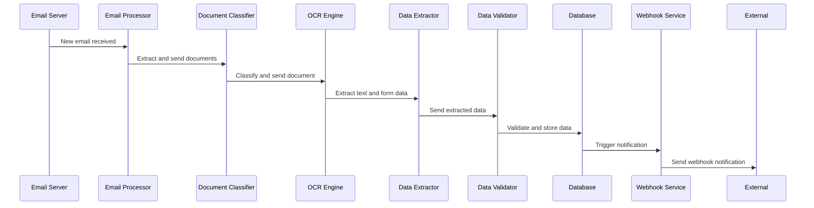

### DATA-FLOW DIAGRAM

The following diagram explains how information moves through the system:

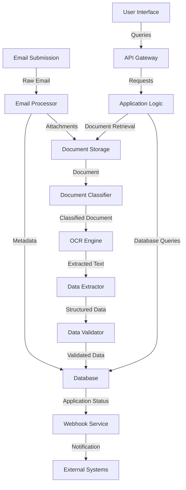

This data-flow diagram illustrates the movement of information from the initial email submission through various processing stages, ultimately resulting in structured data stored in the database and notifications sent to external systems. The user interface interacts with the system through the API gateway, which communicates with the application logic to retrieve and manipulate data from the database and document storage.

## SYSTEM DESIGN

### PROGRAMMING LANGUAGES

The MCA application processing system will utilize the following programming languages, chosen for their suitability to specific components and overall system requirements:

| Language | Purpose | Justification |
|----------|---------|---------------|
| Python 3.9+ | Backend services, API development, data processing | - Excellent for rapid development - Rich ecosystem of libraries for data processing and machine learning - Strong support for asynchronous programming - AWS Lambda compatibility |
| JavaScript (ES6+) | Frontend development, Node.js microservices | - Industry standard for web development - React framework for responsive UI - Node.js for lightweight, scalable microservices |
| SQL | Database queries and management | - Standard language for relational database operations - Compatibility with Amazon Aurora PostgreSQL |
| Bash | DevOps scripts, automation | - Efficient for system-level scripting and automation - Native to Unix-based systems in AWS environment |

### DATABASE DESIGN

The system will use Amazon Aurora PostgreSQL as the primary database. The database schema is designed to efficiently store and manage MCA application data:

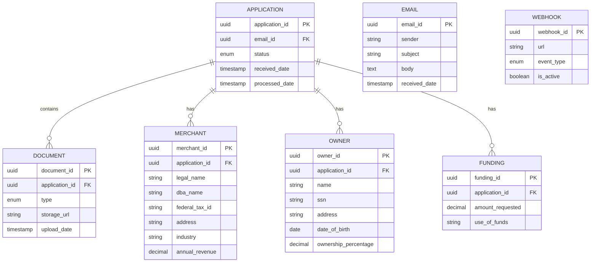

Key considerations for the database design:

1. Use of UUIDs as primary keys for better distribution and scalability
2. Normalization to reduce data redundancy
3. Appropriate use of foreign keys to maintain data integrity
4. Indexing on frequently queried fields for improved performance
5. Use of enumerated types for status and document type fields

### API DESIGN

The system will expose a RESTful API for client integration and internal service communication. The API will follow OpenAPI Specification 3.0 and implement the following key endpoints:

1. Application Management
   - `POST /applications`: Submit a new application
   - `GET /applications`: List applications with filtering and pagination
   - `GET /applications/{id}`: Retrieve a specific application
   - `PATCH /applications/{id}`: Update application status

2. Document Management
   - `GET /applications/{id}/documents`: List documents for an application
   - `GET /documents/{id}`: Retrieve a specific document
   - `POST /documents`: Upload a new document

3. Webhook Management
   - `POST /webhooks`: Register a new webhook
   - `GET /webhooks`: List registered webhooks
   - `DELETE /webhooks/{id}`: Remove a webhook

4. User Management
   - `POST /users`: Create a new user
   - `GET /users`: List users
   - `PATCH /users/{id}`: Update user details

API Security Measures:
- JWT-based authentication
- Rate limiting to prevent abuse
- Input validation and sanitization
- CORS configuration for web client access

### USER INTERFACE DESIGN

The web-based user interface will be developed using React and follow a responsive design approach. Key components of the UI include:

1. Dashboard
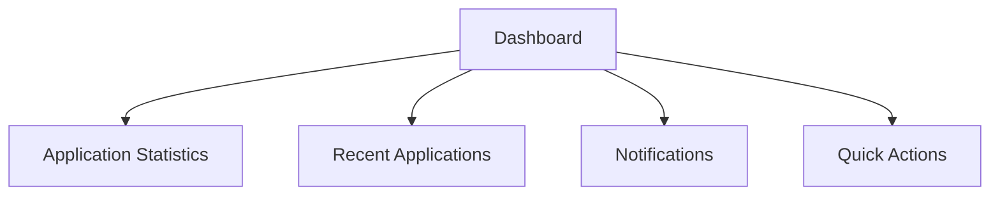

2. Application Management
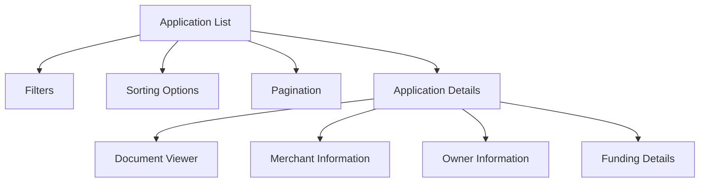

3. Webhook Configuration
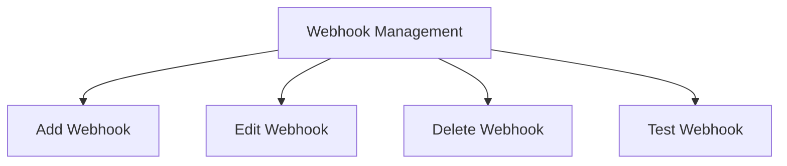

4. User Management
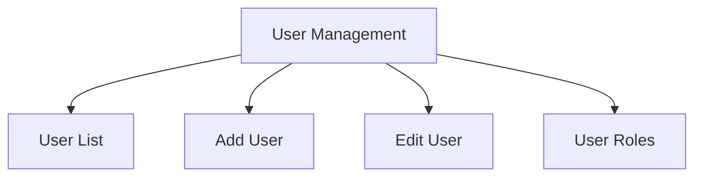

UI Design Principles:
- Intuitive navigation with a clear hierarchy
- Consistent color scheme and typography aligned with Dollar Funding's branding
- Responsive design for desktop and tablet devices
- Accessibility compliance with WCAG 2.1 Level AA standards
- Real-time updates using WebSocket connections for critical information

The user interface will be designed to minimize the learning curve for data entry specialists transitioning from the manual process, while providing advanced features for IT administrators and executives to manage the system effectively.

## TECHNOLOGY STACK

### PROGRAMMING LANGUAGES

The following programming languages have been selected for the MCA application processing system:

| Language | Purpose | Justification |
|----------|---------|---------------|
| Python 3.9+ | Backend services, API development, data processing | - Excellent for rapid development - Rich ecosystem of libraries for data processing and machine learning - Strong support for asynchronous programming - AWS Lambda compatibility |
| JavaScript (ES6+) | Frontend development, Node.js microservices | - Industry standard for web development - React framework for responsive UI - Node.js for lightweight, scalable microservices |
| SQL | Database queries and management | - Standard language for relational database operations - Compatibility with Amazon Aurora PostgreSQL |
| Bash | DevOps scripts, automation | - Efficient for system-level scripting and automation - Native to Unix-based systems in AWS environment |

### FRAMEWORKS AND LIBRARIES

The following frameworks and libraries will be utilized in the development of the MCA application processing system:

| Framework/Library | Purpose | Justification |
|-------------------|---------|---------------|
| FastAPI | Backend API development | - High performance, easy to use Python web framework - Built-in support for asynchronous programming - Automatic API documentation with OpenAPI |
| React | Frontend UI development | - Component-based architecture for reusable UI elements - Virtual DOM for efficient rendering - Large ecosystem and community support |
| Redux | State management | - Predictable state container for JavaScript apps - Centralized state management for complex applications |
| SQLAlchemy | ORM (Object-Relational Mapping) | - Powerful and flexible ORM for Python - Supports multiple database backends |
| Pandas | Data manipulation and analysis | - Efficient data structures for handling large datasets - Rich set of built-in data analysis tools |
| NumPy | Numerical computing | - Fundamental package for scientific computing in Python - Efficient multi-dimensional array operations |
| Pytest | Testing framework | - Feature-rich testing framework for Python - Supports both unit and integration testing |
| Jest | JavaScript testing | - Zero-config testing platform for JavaScript - Built-in code coverage reports |
| Terraform | Infrastructure as Code | - Declarative infrastructure provisioning - Multi-cloud support for future flexibility |

### DATABASES

The following database systems will be employed in the MCA application processing system:

| Database | Purpose | Justification |
|----------|---------|---------------|
| Amazon Aurora PostgreSQL | Primary relational database | - High performance and scalability - PostgreSQL compatibility for advanced features - Managed service reducing operational overhead |
| Amazon DynamoDB | Session management, caching | - Low-latency NoSQL database for high-performance applications - Automatic scaling to handle variable loads |
| Amazon S3 | Document storage | - Scalable object storage for application documents - High durability and availability - Cost-effective for large-scale storage |

### THIRD-PARTY SERVICES

The following external services and APIs will be integrated into the MCA application processing system:

| Service | Purpose | Justification |
|---------|---------|---------------|
| AWS Textract | OCR and data extraction | - Advanced machine learning-based OCR - Specialized in extracting data from forms and tables - Seamless integration with other AWS services |
| AWS Comprehend | Natural language processing | - Entity recognition for improved data extraction - Sentiment analysis for application review prioritization |
| Twilio | SMS notifications | - Reliable SMS gateway for sending notifications - Extensive API for programmatic communication |
| Stripe | Payment processing (if applicable) | - Secure and compliant payment processing - Extensive documentation and SDKs |
| Google Maps API | Address validation and geocoding | - Accurate address validation and normalization - Geocoding for potential future location-based features |
| Sentry | Error tracking and monitoring | - Real-time error tracking and reporting - Performance monitoring for proactive issue resolution |

The technology stack diagram below illustrates the relationships between these components:

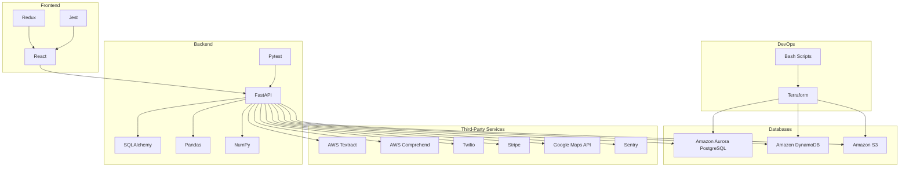

This technology stack has been carefully selected to provide a robust, scalable, and efficient foundation for the MCA application processing system. It leverages modern frameworks and cloud services to ensure high performance, security, and maintainability throughout the application lifecycle.

## SECURITY CONSIDERATIONS

### AUTHENTICATION AND AUTHORIZATION

The MCA application processing system will implement a robust authentication and authorization mechanism to ensure secure access to the system and its resources.

1. Authentication:
   - Multi-factor authentication (MFA) will be mandatory for all user accounts.
   - JSON Web Tokens (JWT) will be used for stateless authentication in the RESTful API.
   - Password policies will enforce strong passwords, including minimum length, complexity, and regular password changes.

2. Authorization:
   - Role-Based Access Control (RBAC) will be implemented to manage user permissions.
   - The following roles will be defined:

| Role | Description | Permissions |
|------|-------------|-------------|
| Admin | System administrators | Full access to all system functions |
| Manager | Dollar Funding management | Access to reports, application overview, and user management |
| Data Entry Specialist | Application processors | Access to application details and document viewing |
| API User | External system integration | Limited API access based on specific permissions |

3. Single Sign-On (SSO):
   - Integration with Dollar Funding's existing SSO solution (e.g., Okta, Azure AD) will be implemented for seamless access.

4. API Authentication:
   - API keys will be used for server-to-server communication.
   - OAuth 2.0 will be implemented for delegated access to API resources.

5. Session Management:
   - Secure session handling with encryption and timeout mechanisms.
   - Automatic session termination after a period of inactivity.

### DATA SECURITY

Protecting sensitive financial and personal information is critical for the MCA application processing system. The following measures will be implemented:

1. Encryption:
   - Data at rest: AES-256 encryption for all sensitive data stored in Amazon Aurora PostgreSQL and Amazon S3.
   - Data in transit: TLS 1.3 for all network communications.

2. Data Masking:
   - Sensitive information (e.g., SSN, Tax ID) will be masked in logs and user interfaces.
   - Data anonymization techniques will be used in non-production environments.

3. Key Management:
   - AWS Key Management Service (KMS) will be used for encryption key management.
   - Regular key rotation will be enforced.

4. Data Loss Prevention (DLP):
   - Implementation of DLP policies to prevent unauthorized data exfiltration.
   - Monitoring and alerting for suspicious data access patterns.

5. Secure File Handling:
   - Antivirus scanning for all uploaded documents.
   - Secure temporary file storage with automatic deletion after processing.

6. Database Security:
   - Implementation of database-level encryption.
   - Regular security patching and updates for the database system.

7. Secure Backup and Recovery:
   - Encrypted backups stored in geographically diverse locations.
   - Regular testing of backup restoration procedures.

### SECURITY PROTOCOLS

The following security protocols and standards will be implemented to maintain the overall security of the MCA application processing system:

1. Network Security:
   - Implementation of Web Application Firewall (WAF) to protect against common web exploits.
   - Use of Virtual Private Cloud (VPC) with proper network segmentation.
   - Regular network vulnerability scans and penetration testing.

2. Security Monitoring and Incident Response:
   - Implementation of a Security Information and Event Management (SIEM) system.
   - 24/7 security monitoring with automated alerts for suspicious activities.
   - Documented incident response plan with regular drills and updates.

3. Secure Development Lifecycle:
   - Implementation of secure coding practices and guidelines.
   - Regular security training for development team members.
   - Automated security scanning of code and dependencies.

4. Compliance and Auditing:
   - Regular security audits to ensure compliance with industry standards (e.g., PCI DSS, SOC 2).
   - Comprehensive logging of all system activities for audit purposes.

5. Third-Party Security:
   - Vendor security assessments for all third-party integrations.
   - Regular review and update of third-party components and libraries.

6. Physical Security:
   - Utilization of AWS's secure data centers with SOC 2 compliance.
   - Implementation of secure access protocols for any on-premises components.

7. Security Patch Management:
   - Regular patching schedule for all system components.
   - Emergency patching process for critical vulnerabilities.

8. Security Architecture:

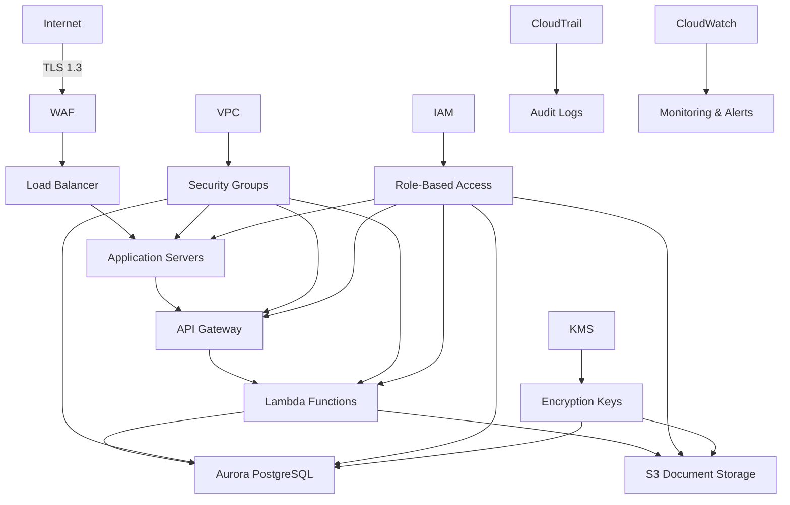

This security architecture diagram illustrates the multi-layered security approach, incorporating network security, access controls, encryption, and monitoring throughout the system.

By implementing these comprehensive security measures, the MCA application processing system will maintain a strong security posture, protecting sensitive financial data and ensuring compliance with relevant industry standards and regulations.